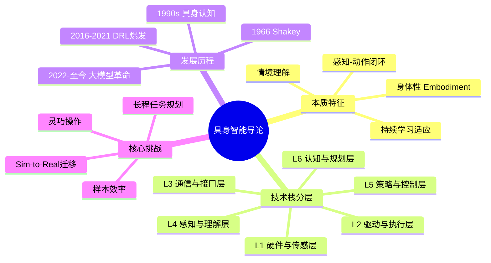

# Day 1 · 具身智能导论

> 导论与基础

← **[[📚 具身智能10天入门|目录]]** → [[Day 2 - 机器人学基础]]

#具身智能 #导论 #SLAM #技术栈

---

## 🗺️ 知识地图



---

## 🎯 核心问题

1. **具身智能是什么？** 与传统"旁观者式"AI 的本质区别在哪里？
2. **为什么需要身体？** 具身认知的科学依据是什么？
3. **技术栈如何分层？** 从硬件感知到高层认知的层级结构是什么？
4. **当前最大瓶颈是什么？** 为什么具身智能仍未大规模落地？

---

## 🔬 核心方法

| 方法/概念 | 核心思想 | 适用场景 |
|-----------|---------|---------|
| 身体性 Embodiment | 智能体拥有物理/虚拟身体载体 | 所有具身任务 |
| 感知-动作闭环 | 传感器→决策→执行器→环境反馈 | 实时交互控制 |
| 情境理解 Situatedness | 在特定环境上下文中有目标地行动 | 长程任务规划 |
| 持续学习 | 在与环境交互中不断优化策略 | Sim2Real适配 |

---

## 🔗 因果链


**关键因果**：身体 → 感知行动闭环 → 情境理解 → 策略迭代 → 具身智能涌现

---

## ⚠️ 易混点

| 混淆对 | 区别 | 典型错误 |
|--------|------|---------|
| 具身AI vs 传统AI | 传统AI处理静态数据；具身AI输出物理动作并与环境实时交互 | 认为"给LLM接个机械臂就是具身智能" |
| 具身认知 vs 具身智能 | 前者是认知科学理论；后者是工程实现 | 混淆理论方向与工程方向 |
| Sim2Real vs 域随机化 | Sim2Real是目标；域随机化是实现手段之一 | 认为"提高仿真精度就能解决Sim2Real" |
| VLA vs 分层规划 | VLA端到端；分层规划是LLM做高层+底层控制器执行 | 在简单任务上过度设计架构 |

---

## 📐 压缩：重建架构

具身智能技术栈的**完整层级架构**：

```
┌─────────────────────────────────────────┐
│  L6 认知与规划层  LLM/VLM推理, 任务规划   │
├─────────────────────────────────────────┤
│  L5 策略与控制层  RL策略, 运动规划, 力控    │
├─────────────────────────────────────────┤
│  L4 感知与理解层  SLAM, 3D重建, 视觉伺服  │
├─────────────────────────────────────────┤
│  L3 通信与接口层  ROS2, MQTT, 实时协议     │
├─────────────────────────────────────────┤
│  L2 驱动与执行层  电机控制, 液压, 力矩输出   │
├─────────────────────────────────────────┤
│  L1 硬件与传感层  RGB-D, LiDAR, IMU, 编码器│
└─────────────────────────────────────────┘
```

---

## 💡 压缩：提炼本质

> **一句话本质**：具身智能 = 身体承载感知 × 动作改变环境 × 闭环迭代涌现智能

**三个不可能替代的核心要素**：
1. **物理载体**（没有身体=传统AI）
2. **实时闭环**（离线训练≠在线交互）
3. **环境反馈**（仿真→真实迁移是永恒难题）

---

## 🔗 压缩：找联系

- **Day 1 ↔ Day 2**：导论中"感知-动作闭环" → 机器人学中的运动学/动力学数学基础
- **Day 1 ↔ Day 4**：导论中"大模型赋能" → 深度学习基础（Transformer/ViT）
- **Day 1 ↔ Day 5**：导论中"策略优化" → 深度强化学习（MDP/PPO）
- **Day 1 ↔ Day 8**：导论中"Sim2Real挑战" → 仿真平台与迁移方法
- **Day 1 ↔ Day 10**：导论中"具身智能定义" → 前沿进展验证定义的正确性

---

## 🚨 压缩：易错点

1. **误区**：具身智能 = 机器人硬件 + AI算法
   **正解**：核心在于「身体与环境的实时交互闭环」，缺此即传统AI

2. **误区**：Sim2Real 通过提高仿真精度可以解决
   **正解**：域随机化（让策略适应各种参数）比高保真仿真更有效

3. **误区**：LLM可以直接输出机器人控制指令
   **正解**：需要VLA模型或分层架构（LLM规划 + 底层控制器执行）

4. **误区**：具身智能只需要视觉感知
   **正解**：触觉、力觉、本体感知同样关键，多模态融合才是完整方案

---

## 📖 详细内容

### 具身智能的定义

具身智能（Embodied Artificial Intelligence）指的是具有身体并能与物理环境实时交互的智能系统。与传统"旁观者式"AI（仅处理静态数据）不同，具身智能强调：

- [x] **身体性（Embodiment）**：智能体拥有物理或虚拟的身体载体
- [x] **感知-动作闭环（Perception-Action Loop）**：通过传感器感知世界，通过执行器改变世界
- [x] **情境理解（Situatedness）**：智能体在特定环境上下文中有目标地行动
- [x] **持续学习与适应**：在与环境交互中不断优化自身策略

### 传统AI vs 具身AI

| 维度 | 传统AI | 具身AI |
|------|--------|--------|
| 输入 | 静态数据（图片/文本/语音） | 实时多模态传感器数据 |
| 输出 | 标签、分类、生成内容 | 物理动作序列 |
| 评估 | 准确率、F1、困惑度 | 任务成功率、效率、泛化性 |
| 与环境关系 | 无直接交互 | 直接作用于物理/仿真环境 |

### 技术栈分层

```
L6: 认知与规划层  → 任务规划、LLM推理、长程决策
L5: 策略与控制层  → RL策略、运动控制、力控
L4: 感知与理解层  → 视觉感知、触觉、SLAM、3D重建
L3: 通信与接口层  → ROS2、MQTT、实时通信协议
L2: 驱动与执行层  → 电机控制、液压驱动、力矩输出
L1: 硬件与传感层  → 相机、LiDAR、IMU、关节编码器
```

### 发展历程

- **1966年 - Shakey机器人**：Stanford研究院推出世界上第一个通用移动机器人
- **1990s - 具身认知科学兴起**：Rodney Brooks提出"包容式架构"，摒弃符号推理
- **2016-2021 - 深度强化学习驱动期**：DQN、AlphaGo、Sim2Real成熟
- **2022-至今 - 大模型革命期**：RT-2、PaLM-E、Figure 01、Optimus Gen-2

### 核心挑战

| 挑战 | 核心难点 | 前沿方向 |
|------|---------|---------|
| Sim-to-Real迁移 | 仿真与真实的动力学差异 | 域随机化、系统辨识 |
| 样本效率 | 真实机器人数据采集成本高 | 模仿学习、离线RL |
| 长程任务规划 | 错误累积、信用分配 | LLM分层规划、VLA |
| 灵巧操作 | 高自由度、接触丰富 | DexMimicGen、扩散策略 |

### 为什么现在是最佳时机？

> [!info] 四大驱动力
> ① **大模型**（LLM/VLM）→ 语义理解与推理能力
> ② **强化学习**（PPO/SAC）→ 策略优化成熟
> ③ **硬件成本下降** → GPU算力提升10倍+
> ④ **开源生态** → Isaac Gym、MuJoCo、ROS2成熟

---

## 📄 必读论文

### 📄 RT-2: Vision-Language-Action Models (Google, 2023)
将VLM直接输出机器人动作，zero-shot泛化能力惊人。 #VLA #必读

### 📄 PaLM-E: An Embodied Multimodal Language Model (Google, 2023)
将具身感知融入大语言模型，实现机器人任务规划。 #多模态 #重要

### 📄 VoxPoser: Composable 3D Value Maps (Stanford, 2023)
用LLM直接生成机器人可执行的动作轨迹，无需训练！ #LLM+机器人 #创新

---

## 💻 环境配置

```python
# 环境配置
conda create -n embodied python=3.10 -y && conda activate embodied
pip install torch torchvision --index-url https://download.pytorch.org/whl/cu118
pip install gymnasium stable-baselines3 pybullet mujoco pygame
pip install transformers accelerate bitsandbytes ultralytics timm
pip install opencv-python numpy pandas matplotlib jupyterlab
```

---

## ✅ 今日任务

- [ ] 理解具身智能3个核心特征：身体性、感知-动作闭环、情境性
- [ ] 能区分传统AI与具身AI的本质差异
- [ ] 完成环境配置，确保PyBullet或Gymnasium可正常运行
- [ ] 运行一个最简单的RL demo（CartPole平衡）

---

## 相关笔记

← **[[📚 具身智能10天入门|目录]]** → [[Day 2 - 机器人学基础]]
