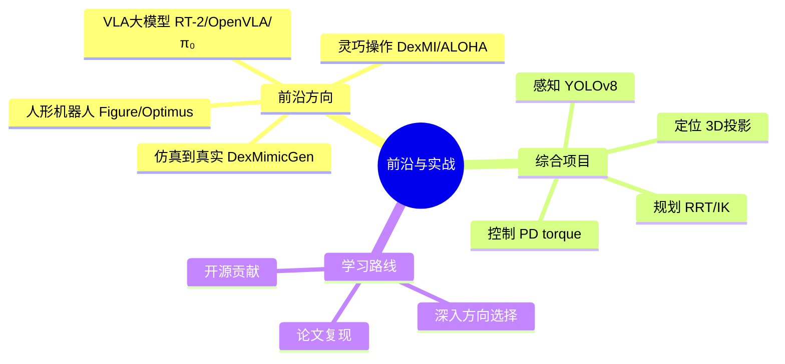

# Day 10 · 前沿与实战

> 2024-2025前沿 + 综合项目

← [[Day 9 - 运动与操作]] **[[📚 具身智能10天入门|目录]]**

#前沿 #实战 #Figure #Optimus

---

## 🗺️ 知识地图



---

## 🎯 核心问题

1. **当前具身智能最前沿的方向是什么？**（人形机器人 / VLA / 灵巧操作）
2. **如何选择一个研究方向深入？**（结合自己的资源/兴趣/能力）
3. **如何从零开始一个具身智能项目？**（硬件选型 / 软件栈 / 数据集）
4. **Day 1-9 的知识如何串联成一个完整系统？**（端到端项目实战）

---

## 🔧 核心方法

| 前沿方向 | 代表工作 | 核心技术 | 落地难度 |
|-----------|---------|---------|---------|
| 人形机器人 | Figure 02, Optimus Gen-2 | 端到端 VLA + 精密硬件 | ★★★ |
| VLA 大模型 | RT-2, OpenVLA, π₀ | 视觉-语言-动作联合训练 | ★★ |
| 灵巧操作 | DexMI, ALOHA, DexPilot | 模仿学习 + 力控 | ★★ |
| Sim2Real | DexMimicGen | 数据增强 + 域随机化 | ★ |

---

## 🔗 因果链（Day 1 → Day 10 完整链路）

```
Day 1: 具身智能定义
  ↓ 需要"身体"来交互
Day 2: 机器人学基础（FK/IK/动力学）
  ↓ 需要"眼睛"来感知
Day 3: 感知系统（相机/SLAM/检测）
  ↓ 需要"大脑"来理解
Day 4: 深度学习（CNN/Transformer/ViT）
  ↓ 需要"学习算法"来优化
Day 5: 深度强化学习（PPO/SAC）
  ↓ 需要"专家数据"来加速
Day 6: 模仿学习（BC/GAIL/扩散策略）
  ↓ 需要"语言理解"来接收指令
Day 7: 大模型+具身（VLA/LLM规划）
  ↓ 需要"仿真环境"来训练
Day 8: 仿真平台（Isaac Gym/MuJoCo）
  ↓ 需要"运动规划"来执行
Day 9: 运动与操作（RRT/抓取/全身控制）
  ↓ 整合所有模块
Day 10: 综合实战项目 — 机械臂目标抓取系统 ✓
```

---

## ⚠️ 易混点

| 混淆对 | 区别 | 典型错误 |
|--------|------|---------|
| 人形机器人 vs 机械臂 | 人形双足/双臂协调；机械臂固定基座 | 认为人形=多个机械臂拼起来 |
| VLA vs 分层规划 | VLA 端到端；分层=LLM规划+底层执行 | 在小任务上过度设计 VLA |
| 模仿学习 vs RL | 模仿快但泛化差；RL 慢但可超越专家 | 认为 RL 一定比模仿学习好 |
| Sim2Real vs 域随机化 | Sim2Real 是目标；域随机化是手段 | 认为提高仿真精度就能解决 Sim2Real |

---

## 📦 压缩：重建架构

**具身智能完整系统架构**（Day 1-10 全部整合）：

```
┌─────────────────────────────────────────────┐
│           指令输入（自然语言）             │
│        "Pick up the red cup"              │
├─────────────────────────────────────────────┤
│          Day 7: LLM 规划层              │
│   ├─ 任务分解: [detect, grasp, lift]  │
│   └─ 子任务下发                         │
├─────────────────────────────────────────────┤
│          Day 3+4: 感知理解层            │
│   ├─ YOLOv8 检测 (Day 3)            │
│   ├─ 深度投影 3D 定位 (Day 3)        │
│   └─ ViT 场景理解 (Day 4)            │
├─────────────────────────────────────────────┤
│          Day 9: 运动规划层              │
│   ├─ 6-DOF 抓取位姿估计 (Day 9)    │
│   ├─ RRT* 无碰撞轨迹 (Day 9)         │
│   └─ IK 逆解关节角 (Day 2)           │
├─────────────────────────────────────────────┤
│          Day 2+5+6: 控制执行层        │
│   ├─ PD 力矩控制 (Day 2)             │
│   ├─ PPO/SAC 策略控制 (Day 5)        │
│   └─ 模仿学习策略 (Day 6)             │
├─────────────────────────────────────────────┤
│          Day 8: 仿真训练层（离线）      │
│   └─ Isaac Gym 大规模预训练            │
└─────────────────────────────────────────────┘
           ↓ Sim2Real (Day 8)
┌─────────────────────────────────────────────┐
│          真实机器人执行                   │
└─────────────────────────────────────────────┘
```

---

## 💡 压缩：提炼本质

> **具身智能的本质**（10天浓缩）：
> 用「身体」感知世界 → 用「大脑」（DL/RL/LLM）决策 → 用「肢体」（运动学/动力学）行动 → 在「环境」中通过闭环持续学习。

**五个核心公理**：
1. 没有感知-动作闭环 = 传统 AI（不是具身）
2. 没有 Sim2Real 方案 = 无法落地（只是仿真玩具）
3. 没有大模型赋能 = 无法理解自然语言指令（交互受限）
4. 没有多模态融合 = 无法处理复杂真实场景（鲁棒性差）
5. 没有持续学习 = 无法适应新环境（静态策略）

**一句话总结 10 天**：
> 具身智能 = 感知（Day 3）+ 认知（Day 4/7）+ 决策（Day 5/6/7）+ 行动（Day 2/9），在仿真（Day 8）中训练，部署到真实世界。

---

## 🔗 压缩：找联系

**跨 Day 知识联系全景**：

| 模块 | 涉及 Day | 联系要点 |
|------|-----------|---------|
| 感知 → 规划 | Day 3 ↔ Day 9 | YOLO 检测 → 6-DOF 抓取位姿 |
| 规划 → 控制 | Day 9 ↔ Day 2 | RRT 轨迹 → IK 关节角 → 力矩计算 |
| 控制 → 学习 | Day 2 ↔ Day 5 | 动力学方程 M(q) 是 RL 奖励函数的物理先验 |
| 学习 → 仿真 | Day 5/6 ↔ Day 8 | RL/模仿学习依赖仿真器采样效率 |
| 大模型 → 执行 | Day 7 ↔ Day 9 | LLM 规划输出 → 运动规划器执行 |
| 仿真 → 真实 | Day 8 ↔ All | 所有模块的训练结果都要经过 Sim2Real |

---

## 🚨 压缩：易错点

1. **想一口吃成胖子**：直接上手人形机器人 VLA，建议从机械臂抓取开始
2. **忽略 Sim2Real**：在仿真中调参调半年，真机完全不能用
3. **感知与控制系统频率不匹配**：相机 30Hz + 控制 200Hz → 动作滞后
4. **过度依赖大模型**：小任务（抓取/推物）不需要 LLM，传统方法更快更稳
5. **数据集质量差**：采集演示时抖动大、视角差 → 策略学偏

---

## 📖 详细内容

### 前沿进展（2024-2025）

#### 📄 Figure 02 + OpenAI（2024）
OpenAI 多模态大模型赋能 Figure 机器人，实现端到端语音-视觉-动作控制。#商业化 #标杆

#### 📄 Optimus Gen-2（Tesla, 2024）**
特斯拉人形机器人展示了自主行走、精准抓取等能力。#人形机器人

#### 📄 Physical Intelligence π₀（2024）**
将 Diffusion Policy 与 VLM 结合，构建通用机器人基础模型。#SOTA #创新

#### 📄 伯克利 DexMI（2024）**
使用模仿学习和域随机化，实现零样本泛化到新物体的抓取。#Sim2Real

#### 📄 Stanford RoboClaude（2024）**
在 Claude 大模型基础上微调的具身智能体。#LLM+具身

---

## 🛠️ 综合实战项目

**项目：机械臂目标抓取系统**
架构：`感知(检测) → 定位(3D) → 规划(IK) → 执行(控制)`

```python
# ===== 具身智能综合实战项目 =====
# 架构: 感知(检测) → 定位(3D) → 规划(IK) → 执行(控制)
import torch; import cv2; import numpy as np
from ultralytics import YOLO
from scipy.optimize import minimize

# ===== 模块1: 感知层（YOLOv8 目标检测）=====
class PerceptionModule:
    def __init__(self): self.detector = YOLO("yolov8n.pt")
    def detect(self, rgb, target_class="cup"):
        results = self.detector(rgb, verbose=False)[0]
        for box, conf, cls in zip(results.boxes.xyxy, results.boxes.conf, results.boxes.cls):
            label = self.detector.names[int(cls)]
            if label == target_class:
                x1, y1, x2, y2 = box.cpu().numpy()
                return {"bbox": (x1,y1,x2,y2), "conf": float(conf),
                        "center": ((x1+x2)/2, (y1+y2)/2)}
        return None

# ===== 模块2: 3D定位（深度投影）=====
class LocalizationModule:
    def __init__(self, K): self.K = K
    def depth_to_3d(self, u, v, depth):
        z = depth / 1000.0
        x = (u - self.K[0,2]) * z / self.K[0,0]
        y = (v - self.K[1,2]) * z / self.K[1,1]
        return np.array([x, y, z])

# ===== 模块3: 运动规划（IK）=====
class MotionPlanner:
    def __init__(self, link_lengths=[0.3,0.3,0.2]):
        self.link_lengths = link_lengths
    def solve_ik(self, target_pos, n_starts=30):
        def error(angles):
            # 简化的平面 FK
            T = np.eye(4); cum = 0
            for theta, L in zip(angles, self.link_lengths):
                cum += theta
                T = T @ np.array([
                    [np.cos(cum), -np.sin(cum), 0, L*np.cos(cum)],
                    [np.sin(cum),  np.cos(cum), 0, L*np.sin(cum)],
                    [0,             0,            1, 0],
                    [0,             0,            0, 1]
                ])
            return np.sum((T[:3,3] - target_pos)**2)
        best, best_err = None, 1e10
        for _ in range(n_starts):
            res = minimize(error, np.random.uniform(-np.pi, np.pi, len(self.link_lengths)),
                         method='L-BFGS-B')
            if res.fun < best_err: best_err = res.fun; best = res.x
        return best, np.sqrt(best_err)

# ===== 模块4: 控制器（PD torque）=====
class JointController:
    def __init__(self, n_joints=3):
        self.Kp = np.eye(n_joints) * 2.0
        self.Kd = np.eye(n_joints) * 0.5
    def compute_torque(self, q_des, qd_des, q, qd):
        return self.Kp @ (q_des - q) + self.Kd @ (qd_des - qd)

# ===== 综合系统：目标抓取流水线 =====
class RobotGraspSystem:
    def __init__(self, K, link_lengths):
        self.perception   = PerceptionModule()
        self.localization = LocalizationModule(K)
        self.planner     = MotionPlanner(link_lengths)
        self.controller  = JointController(len(link_lengths))
    def grasip_object(self, rgb, depth, target_class="cup"):
        # Step 1: 目标检测
        detection = self.perception.detect(rgb, target_class)
        if detection is None: return None
        cu, cv = detection["center"]
        # Step 2: 3D 定位
        pos_3d = self.localization.depth_to_3d(int(cu), int(cv),
                                                  depth[int(cv), int(cu)])
        # Step 3: 运动规划（IK）
        q_des, err = self.planner.solve_ik(pos_3d)
        # Step 4: 控制器执行
        torque = self.controller.compute_torque(
            q_des, np.zeros_like(q_des),
            np.zeros_like(q_des), np.zeros_like(q_des))
        return {"detection": detection, "position_3d": pos_3d,
                "joint_angles": q_des, "torque": torque}

print("✅ 综合实战项目框架完成！继续完善各模块即可部署到真实机器人。")
```

---

## 📚 资源导航

| 类型 | 推荐 |
|------|------|
| **课程** | CS224n（NLP）, CS231n（CV）, CS287（机器人学）, DeepRL Bootcamp |
| **工具** | Gymnasium, stable-baselines3, Isaac Gym, MuJoCo, ROS2 |
| **必读论文** | RT-2, PaLM-E, VoxPoser, PPO, 3D Diffusion Policy, ACT/ALOHA |
| **比赛/社区** | RoboCup, DARPA SubT, Open Robotics, Figure AI, 宇树开源 |

---

> [!info] 🎉 恭喜完成10天具身智能入门！
> 从机器人学基础，到感知、规划、决策，再到最新的大模型赋能，你现在有了完整的知识框架。
> **接下来**：
> ① 选一个感兴趣的方向深入（VLA / 模仿学习 / 运动控制）
> ② 复现一篇顶级论文
> ③ 参与开源机器人项目
> ④ 动手做自己的机器人项目！
> **具身智能的未来，等你来创造！**

---

## ✅ 今日任务

- [ ] 整理10天学习笔记，构建自己的知识图谱
- [ ] 选择一个方向深入：推荐 VLA（OpenVLA）或扩散策略（Diffusion Policy）
- [ ] 开始构思自己的机器人项目（可以用 PyBullet + PPO 实现一个简单任务）
- [ ] 关注 arXiv/cs.CL 上的具身智能最新论文，保持持续学习

---

## 相关笔记

← [[Day 9 - 运动与操作]] **[[📚 具身智能10天入门|目录]]**
