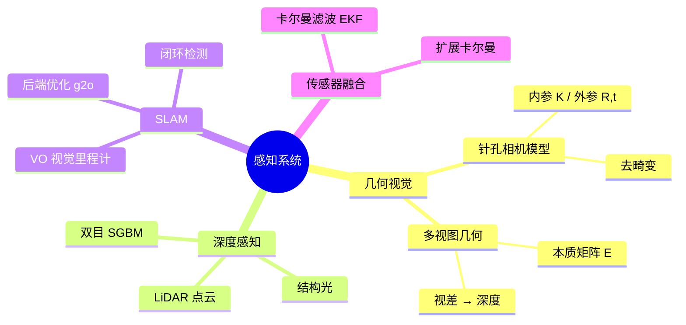

# Day 3 · 感知系统

> 视觉、深度、SLAM与传感器融合

← [[Day 2 - 机器人学基础]] **[[📚 具身智能10天入门|目录]]** → [[Day 4 - 深度学习基础]]

#感知 #计算机视觉 #SLAM #YOLO

---

## 🗺️ 知识地图



---

## 🎯 核心问题

1. **2D像素如何还原3D世界？**（相机模型 + 深度估计）
2. **机器人如何在未知环境中定位自身？**（SLAM 前端跟踪 + 后端优化）
3. **不同传感器数据如何统一表达？**（传感器融合 / 坐标系对齐）
4. **动态环境中如何保持感知鲁棒性？**（光照变化 / 运动模糊 / 遮挡）

---

## 🔧 核心方法

| 方法 | 核心思想 | 适用场景 |
|------|---------|---------|
| 针孔相机模型 | $s·[u,v,1]^T = K·[R\|t]·[X,Y,Z,1]^T$ | 所有视觉感知的基础 |
| 双目SGBM | 块匹配计算视差 $d = x_L - x_R$，深度 $Z = fB/d$ | 室内机器人导航 |
| ORB特征匹配 | 旋转不变的二进制描述子 | VO / SLAM 前端 |
| 本质矩阵 E | 对极约束 $x_2^T E x_1 = 0$ | 两视图位姿估计 |
| 图优化 g2o | 将位姿和路标建模为图，最小化重投影误差 | SLAM 后端 |
| YOLOv8 | 单阶段端到端检测 | 实时物体感知 |

---

## 🔗 因果链

```
原始图像（2D像素）
  ↓ 针孔模型 + 内参标定
去畸变图像 + 像素坐标 (u,v)
  ↓ 双目匹配 / 深度相机
3D点云 (X,Y,Z)
  ↓ ORB特征提取 + 帧间匹配
相机位姿变换 T_k→k+1（视觉里程计）
  ↓ 图优化（局部BA）
全局一致性轨迹 + 环境地图
  ↓ YOLOv8 目标检测
感知对象3D位置 → 下游规划/抓取
```

---

## ⚠️ 易混点

| 混淆对 | 区别 | 典型错误 |
|--------|------|---------|
| 内参 K vs 外参 [R\|t] | 内参是相机固有属性；外参是相机与世界坐标系关系 | 在SLAM优化中只优化内参 |
| 视差 d vs 深度 Z | $Z = fB/d$，视差大=深度小，非线性关系 | 认为视差与深度成正比 |
| VO vs SLAM | VO只估计相机运动；SLAM同时建图 + 闭环 | 在VO系统中加入闭环检测（应该用完整SLAM）|
| EKF vs 图优化 | EKF是滤波框架，逐个处理；图优化是批量优化 | 在大场景中用EKF（应该用图优化）|
| 稀疏SLAM vs 稠密SLAM | 稀疏只用特征点；稠密重建完整深度图 | 在资源受限嵌入式平台上跑稠密SLAM |

---

## 📦 压缩：重建架构

感知系统数据流架构：

```
┌────────────────────────────────────────────┐
│  传感器层（硬件）                         │
│  RGB相机 / 深度相机 / LiDAR / IMU       │
├────────────────────────────────────────────┤
│  预处理层                                 │
│  去畸变 → 时间同步 → 坐标系对齐         │
├────────────────────────────────────────────┤
│  感知算法层                               │
│  VO前端（ORB匹配）                      │
│  SLAM后端（g2o图优化）                 │
│  目标检测（YOLOv8）                    │
├────────────────────────────────────────────┤
│  融合层                                   │
│  EKF / 粒子滤波 → 统一状态估计          │
├────────────────────────────────────────────┤
│  输出层（给规划/控制）                   │
│  相机位姿 + 环境地图 + 物体3D框          │
└────────────────────────────────────────────┘
```

---

## 💡 压缩：提炼本质

> **相机模型的本质**：世界3D点 → 透视投影 → 2D像素，是一个「维度丢失」过程，深度信息必须通过额外手段（双目/结构光/ToF）恢复。

> **SLAM的本质**：「我到哪里了」+「这里是什么样子」，两个问题是耦合的，联合优化才能得到一致性解。

> **传感器融合的本质**：每个传感器都有盲区和噪声，融合利用冗余信息提高鲁棒性。

**一句话记忆**：
- 内参 = 相机"是谁"；外参 = 相机"在哪"
- 视差越大 → 物体越近；视差越小 → 物体越远
- SLAM = 前端跟踪（快） + 后端优化（准） + 闭环（全局一致）

---

## 🔗 压缩：找联系

- **Day 3 ↔ Day 1**：感知系统是「感知-动作闭环」的感知端
- **Day 3 ↔ Day 4**：相机图像 → CNN/ViT 特征提取 → 检测/分割
- **Day 3 ↔ Day 5**：SLAM位姿估计 → RL状态空间设计
- **Day 3 ↔ Day 8**：仿真中感知数据（RGB-D）的渲染质量决定 Sim2Real 难度
- **Day 3 ↔ Day 9**：3D物体检测 → 抓取点预测（6-DOF grasp）

---

## 🚨 压缩：易错点

1. **相机标定只做一次**：温度/振动会改变内参，长期部署需要在线标定
2. **双目基线 B 的选择**：B 大 → 远距离精度高但近处视差难匹配；B 小 → 相反
3. **ORB特征在弱纹理场景下失效**：白墙、纯色桌面会导致 VO 跟踪丢失
4. **SLAM尺度模糊**：单目SLAM无法恢复真实尺度，必须用IMU或双目/深度相机
5. **YOLO输出的是2D框**：要结合深度图才能获取3D位置，直接用于抓取会失败

---

## 📖 详细内容

### 1.1 针孔相机模型

$$s \cdot \begin{bmatrix} u \\ v \\ 1 \end{bmatrix} = K \cdot \begin{bmatrix} R & t \end{bmatrix} \cdot \begin{bmatrix} X \\ Y \\ Z \\ 1 \end{bmatrix}$$

K 是相机内参矩阵（$f_x, f_y, c_x, c_y$），$[R\|t]$ 是外参矩阵。

```python
# 相机标定与去畸变
import cv2; import numpy as np; import glob

def calibrate_camera(image_dir, board_size=(9,6)):
    objp = np.zeros((board_size[0]*board_size[1],3),np.float32)
    objp[:,:2] = np.mgrid[0:board_size[0],0:board_size[1]].T.reshape(-1,2)
    objpoints, imgpoints = [], []
    for fname in glob.glob(f'{image_dir}/*.png'):
        img = cv2.imread(fname); gray = cv2.cvtColor(img, cv2.COLOR_BGR2GRAY)
        ret, corners = cv2.findChessboardCorners(gray, board_size, None)
        if ret:
            objpoints.append(objp)
            corners2 = cv2.cornerSubPix(gray,corners,(11,11),(-1,-1),
                                criteria=(cv2.TERM_CRITERIA_EPS+cv2.TERM_CRITERIA_MAX_ITER,30,0.001))
            imgpoints.append(corners2)
    ret, K, dist, rvecs, tvecs = cv2.calibrateCamera(objpoints,imgpoints,gray.shape[::-1],None,None)
    return K, dist

def pixel_to_camera(u, v, K, depth):
    x = (u - K[0,2]) * depth / K[0,0]
    y = (v - K[1,2]) * depth / K[1,1]
    return np.array([x, y, depth])
```

---

### 1.2 双目深度估计

```python
# 双目SGBM深度估计
def stereo_depth(left_img, right_img, f=718, B=0.54):
    gray_l = cv2.cvtColor(left_img,cv2.COLOR_BGR2GRAY)
    gray_r = cv2.cvtColor(right_img,cv2.COLOR_BGR2GRAY)
    stereo = cv2.StereoSGBM_create(minDisparity=0,numDisparities=128,blockSize=5)
    disparity = stereo.compute(gray_l,gray_r).astype(np.float32)/16.0
    with np.errstate(divide='ignore'): depth = (f * B) / (disparity + 1e-6)
    depth[disparity<= 0] = 0; return depth
```

---

### 2 SLAM 系统

| 类型 | 代表算法 | 特点 |
|------|---------|------|
| 视觉SLAM | ORB-SLAM3, DSO, LSD-SLAM | 纯视觉，轻量 |
| 激光SLAM | LOAM, LIO-SAM | 精度高，抗干扰 |
| 视觉惯性融合 | VIO, ORB-SLAM3-VI | 当前最主流 |
| 图优化 | g2o/GTSAM/Ceres | 后端求解器 |

```python
# 简化视觉里程计（VO）：基于ORB特征匹配
class SimpleVO:
    def __init__(self, K):
        self.K = K; self.prev_features = None; self.pose = np.eye(4)
        self.detector = cv2.ORB_create(2000)
        self.matcher = cv2.BFMatcher(cv2.NORM_HAMMING, crossCheck=True)

    def track(self, img):
        gray = cv2.cvtColor(img,cv2.COLOR_BGR2GRAY)
        kp, des = self.detector.detectAndCompute(gray,None)
        if self.prev_features is None: self.prev_features=(kp,des,gray); return self.pose
        matches = self.matcher.match(des,self.prev_features[1])
        matches = sorted(matches,key=lambda x:x.distance)[:100]
        pts_curr = np.float32([kp[m.queryIdx].pt for m in matches])
        pts_prev = np.float32([self.prev_features[0][m.trainIdx].pt for m in matches])
        E, mask = cv2.findEssentialMat(pts_curr,pts_prev,self.K,cv2.RANSAC,0.999,1.0)
        _,R,t,_ = cv2.recoverPose(E,pts_curr,pts_prev,self.K)
        T = np.eye(4); T[:3,:3] = R; T[:3,3] = t.flatten()
        self.pose = self.pose @ T; self.prev_features=(kp,des,gray); return self.pose
```

---

### 3 YOLOv8 + 3D定位

```python
# YOLOv8目标检测 + 深度图3D定位
from ultralytics import YOLO

def detect_and_localize(rgb, depth, K):
    model = YOLO('yolov8n.pt'); results = model(rgb,verbose=False)[0]
    detections = []
    for box,conf,cls in zip(results.boxes.xyxy,results.boxes.conf,results.boxes.cls):
        x1,y1,x2,y2 = box.cpu().numpy()
        u,v = int((x1+x2)/2), int((y1+y2)/2)
        z = depth[v,u]/1000.0
        X = (u-K[0,2])*z/K[0,0]; Y = (v-K[1,2])*z/K[1,1]
        label = model.names[int(cls)]; detections.append((label,float(conf),(X,Y,z)))
        print(f"{label}@{conf:.2f} → 3D: ({X:.3f},{Y:.3f},{z:.3f})m")
    return detections
```

---

## ✅ 今日任务

- [ ] 理解针孔相机模型和内参标定的原理
- [ ] 用OpenCV实现双目深度估计（SGBM算法）
- [ ] 运行YOLOv8对图像进行目标检测
- [ ] 了解ORB-SLAM3的工作原理和关键组件

---

## 相关笔记

← [[Day 2 - 机器人学基础]] **[[📚 具身智能10天入门|目录]]** → [[Day 4 - 深度学习基础]]
