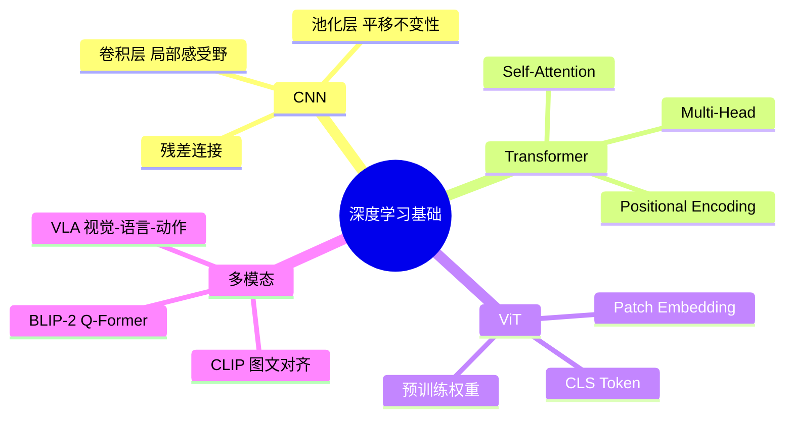

# Day 4 · 深度学习基础

> CNN、Transformer与多模态模型

← [[Day 3 - 感知系统]] **[[📚 具身智能10天入门|目录]]** → [[Day 5 - 深度强化学习]]

#深度学习 #CNN #Transformer #ViT

---

## 🗺️ 知识地图



---

## 🎯 核心问题

1. **CNN 的局部偏置是否适合机器人感知？**（平移不变性 vs 空间结构）
2. **Transformer 如何替代 CNN 成为视觉骨干？**（Global receptive field）
3. **如何将视觉特征对齐到语言空间？**（多模态预训练的目标函数）
4. **具身智能需要什么样的视觉表示？**（语义 vs 几何 vs 动作对齐）

---

## 🔧 核心方法

| 方法 | 核心思想 | 具身应用场景 |
|------|---------|---------|
| ResNet 残差块 | $y = F(x) + x$，解决梯度消失 | 机器人视觉特征提取 backbone |
| ViT Patch Embedding | 图像切块 → Token 序列 → Transformer | 需要全局理解的场景理解 |
| Multi-Head Attention | 多头并行，捕获不同子空间依赖 | 多模态融合（视觉+语言+状态） |
| CLIP 对比学习 | $\mathcal{L} = -\log \frac{\exp(s_+)}{\exp(s_+)+\sum \exp(s_-)}$ | 视觉-语言对齐，VLA 预训练 |
| BLIP-2 Q-Former | 轻量 Query 压缩视觉 → LLM | 机器人场景理解，少样本学习 |
| 扩散模型 | 逐步去噪 $x_{t-1} = \frac{1}{\sqrt{\alpha_t}}(x_t - \frac{1-\alpha_t}{\sqrt{1-\bar{\alpha}_t}}\epsilon_\theta) + \sigma_t z$ | 扩散策略 Diffusion Policy |

---

## 🔗 因果链

```
原始图像像素
  ↓ CNN/ViT 特征提取
高维视觉特征（语义丰富）
  ↓ 多模态对齐（CLIP/BLIP-2）
统一多模态嵌入空间
  ↓ 策略网络 / 扩散模型
连续动作序列 a_t
  ↓ 执行器
环境状态改变 → 新的观测
  ↓ 闭环
策略迭代优化
```

---

## ⚠️ 易混点

| 混淆对 | 区别 | 典型错误 |
|--------|------|---------|
| CNN vs ViT | CNN 局部先验强，ViT 全局但需大数据 | 小数据集上盲目用 ViT |
| CLIP vs BLIP-2 | CLIP 双塔结构；BLIP-2 有 Q-Former 桥接 | 认为 CLIP 特征可直接用于机器人控制 |
| Attention vs MLP | Attention 是关系建模；MLP 是逐位置变换 | 在 ViT 中只用 MLP 块（缺少 Attention）|
| 预训练 vs 微调 | 预训练学通用表示；微调适配特定任务 | 在小机器人数据集上从头训 ViT |
| 连续动作 vs 离散动作 | 连续用扩散/高斯；离散用 softmax 分类 | 对连续控制问题用交叉熵损失 |

---

## 📦 压缩：重建架构

具身智能视觉架构全景：

```
输入：RGB图像 / 深度图 / 点云
  ↓
[视觉编码器]
  ├─ CNN 路线：ResNet → Feature Map → Spatial Softmax
  ├─ ViT 路线：Patch Embed → Transformer → CLS/Patches
  └─ 多模态：ViT + Text Encoder → 跨模态注意力
  ↓
[特征融合]
  ├─ 早期融合：像素级拼接
  ├─ 中期融合：特征级注意力
  └─ 晚期融合：决策级加权
  ↓
[策略头]
  ├─ 离散：Transformer Decoder 输出 action token
  ├─ 连续：MLP 输出 μ,σ / 扩散模型去噪
  └─ 分层：高层 VLM 规划 + 低层 RL 执行
```

---

## 💡 压缩：提炼本质

> **深度学习的本质**：通过多层非线性变换，将原始感知数据映射到任务相关的特征空间，并进一步映射到动作空间。

**三个关键设计轴**：
1. **归纳偏置**：CNN（局部）vs ViT（全局）→ 数据量决定选择
2. **训练目标**：监督 / 对比 / 生成 → 决定表示的质量
3. **策略形式**：离散 token / 连续高斯 / 扩散 → 决定动作多样性

**记忆口诀**：
- CNN：局部 → 层次 → 平移不变
- Transformer：全局 → 注意力 → 数据 hungry
- 多模态：对齐 → 融合 → 推理

---

## 🔗 压缩：找联系

- **Day 4 ↔ Day 3**：CNN/ViT 是感知系统的「特征提取器」，替代手工特征
- **Day 4 ↔ Day 5**：深度网络参数化策略 $\pi_\theta(a|s)$，用 RL 优化 $\theta$
- **Day 4 ↔ Day 6**：模仿学习直接用专家数据训 $\pi_\theta$，跳过 RL 探索
- **Day 4 ↔ Day 7**：LLM/VLM 是预训练 Transformer，用于任务规划和 VLA

---

## 🚨 压缩：易错点

1. **预训练权重不匹配**：ImageNet 预训练 ≠ 机器人域，Sim2Real 需域适应
2. **ViT 位置编码**：2D 位置编码在具身场景中很重要，不要随意丢弃
3. **梯度爆炸/消失**：Transformer 要用 Pre-LN + 学习率 warmup
4. **过拟合小数据**：机器人数据稀缺，必须要用预训练 + 数据增强
5. **CLIP 特征语义强但几何弱**：不适合需要精确 3D 定位的任务

---

## 📖 详细内容

### 1.1 CNN 与残差网络

```python
# PyTorch: ResNet-18 视觉特征提取器（timm库，推荐直接用）
import torch; import timm

backbone = timm.create_model('resnet18', pretrained=True, num_classes=0)
x = torch.randn(4, 3, 224, 224)
features = backbone(x)  # [4, 512] 全局视觉特征
print(f"特征形状: {features.shape}")

# 从零实现残差块（理解原理）
import torch.nn as nn; import torch.nn.functional as F
class ResBlock(nn.Module):
    def __init__(self, in_ch, out_ch, stride=1):
        super().__init__()
        self.conv1 = nn.Conv2d(in_ch, out_ch, 3, stride=stride, padding=1, bias=False)
        self.bn1 = nn.BatchNorm2d(out_ch)
        self.conv2 = nn.Conv2d(out_ch, out_ch, 3, padding=1, bias=False)
        self.bn2 = nn.BatchNorm2d(out_ch)
        self.shortcut = nn.Sequential()
        if stride != 1 or in_ch != out_ch:
            self.shortcut = nn.Sequential(nn.Conv2d(in_ch, out_ch, 1, stride=stride, bias=False),
                                         nn.BatchNorm2d(out_ch))
    def forward(self, x):
        out = F.relu(self.bn1(self.conv1(x)))
        out = self.bn2(self.conv2(out))
        out += self.shortcut(x)
        return F.relu(out)
```

---

### 2.1 Scaled Dot-Product Attention

$$\text{Attention}(Q,K,V) = \text{softmax}\left(\frac{QK^T}{\sqrt{d_k}}\right) \cdot V$$

```python
import math
class MultiHeadAttention(nn.Module):
    def __init__(self, d_model=512, n_heads=8):
        super().__init__(); self.d_k = d_model // n_heads
        self.W_q = nn.Linear(d_model, d_model)
        self.W_k = nn.Linear(d_model, d_model)
        self.W_v = nn.Linear(d_model, d_model)
        self.W_o = nn.Linear(d_model, d_model)
        self.n_heads = n_heads
    def forward(self, query, key, value, mask=None):
        B = query.size(0)
        Q = self.W_q(query).view(B, -1, self.n_heads, self.d_k).transpose(1, 2)
        K = self.W_k(key).view(B, -1, self.n_heads, self.d_k).transpose(1, 2)
        V = self.W_v(value).view(B, -1, self.n_heads, self.d_k).transpose(1, 2)
        scores = Q @ K.transpose(-2, -1) / math.sqrt(self.d_k)
        if mask is not None: scores = scores.masked_fill(mask == 0, -1e9)
        attn = F.softmax(scores, dim=-1)
        out = attn @ V
        out = out.transpose(1, 2).contiguous().view(B, -1, self.n_heads * self.d_k)
        return self.W_o(out)
```

---

### 2.2 Vision Transformer (ViT)

```python
class ViT(nn.Module):
    def __init__(self, img_size=224, patch_size=16, d_model=768, n_heads=12, n_layers=12):
        super().__init__()
        self.patch_embed = nn.Conv2d(3, d_model, patch_size, stride=patch_size)
        self.cls_token = nn.Parameter(torch.zeros(1, 1, d_model))
        self.pos_embed = nn.Parameter(torch.zeros(1, (img_size // patch_size)**2 + 1, d_model))
        encoder_layer = nn.TransformerEncoderLayer(d_model, n_heads, batch_first=True)
        self.encoder = nn.TransformerEncoder(encoder_layer, n_layers)
        self.head = nn.Linear(d_model, 1000)
    def forward(self, x):
        B = x.size(0)
        x = self.patch_embed(x).flatten(2).transpose(1, 2)
        cls = self.cls_token.expand(B, -1, -1)
        x = torch.cat([cls, x], dim=1)
        x = x + self.pos_embed
        x = self.encoder(x)
        return self.head(x[:, 0])  # [CLS] token 分类
```

---

### 3. 多模态模型（CLIP / BLIP-2 / VLA）

```python
# BLIP-2 视觉问答（VLM赋能机器人场景理解）
from transformers import Blip2Processor, Blip2ForConditionalGeneration
from PIL import Image; import torch

processor = Blip2Processor.from_pretrained("Salesforce/blip2-opt-2.7b")
model = Blip2ForConditionalGeneration.from_pretrained(
    "Salesforce/blip2-opt-2.7b", torch_dtype=torch.float16).to("cuda")
image = Image.open("robot_scene.jpg").convert("RGB")
question = "What is the robot doing and what should it do next?"
inputs = processor(images=image, text=question, return_tensors="pt").to("cuda", torch.float16)
out = model.generate(**inputs, max_new_tokens=128)
answer = processor.decode(out[0], skip_special_tokens=True)
print(f"场景理解: {answer}")
```

---

## ✅ 今日任务

- [ ] 理解残差连接、LayerNorm、GELU 在 Transformer 中的作用
- [ ] 用 PyTorch 实现多头自注意力（MHA）模块
- [ ] 运行 BLIP-2 对真实机器人场景图像进行问答
- [ ] 阅读：Attention is All You Need（Transformer 原论文）核心章节

---

## 相关笔记

← [[Day 3 - 感知系统]] **[[📚 具身智能10天入门|目录]]** → [[Day 5 - 深度强化学习]]
