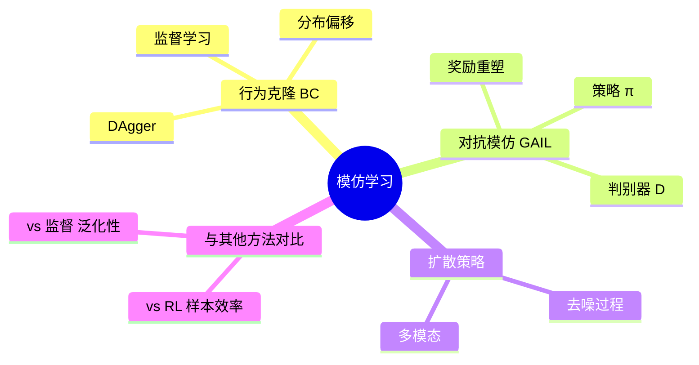

# Day 6 · 模仿学习

> 行为克隆、DAgger、GAIL、扩散策略

← [[Day 5 - 深度强化学习]] **[[📚 具身智能10天入门|目录]]** → [[Day 7 - 大模型+具身]]

#模仿学习 #行为克隆 #GAIL #扩散策略

---

## 🗺️ 知识地图



---

## 🎯 核心问题

1. **如何从历史演示数据中学到策略？**（行为克隆 BC）
2. **BC 的分布偏移如何解决？**（DAgger 数据集聚合）
3. **如何不用奖励函数就学会专家行为？**（GAIL 对抗训练）
4. **如何生成多模态、高精度的动作序列？**（扩散策略）

---

## 🔧 核心方法

| 方法 | 核心思想 | 适用场景 |
|------|---------|---------|
| 行为克隆 BC | 监督学习：$\min L_{BC}(θ) = 𝔼_{(s,a)∼D}[-\log π_θ(a|s)]$ | 演示充足、任务简单 |
| DAgger | 交互中收集「当前策略访问的状态」并用专家标注 | BC 分布偏移严重 |
| GAIL | 对抗训练：判别器 $D_ω$ 区分专家/策略数据 | 无奖励函数的复杂任务 |
| 扩散策略 | 逐步去噪生成动作 $a_0 = \text{diffuse}(s)$ | 多模态、高精度操作 |
| ACT (ALOHA) | CVAE + Transformer，低延迟遥操作数据 | 灵巧操作、双臂协调 |

---

## 🔗 因果链

```
专家演示数据集 D_expert = {(s_i, a_i)}
  ↓ 行为克隆 BC
π_θ(a|s) ≈ π_expert(a|s)  在 D_expert 分布上
  ↓ 分布偏移（复合误差）
s_t ∼ π_θ ≠ s_t ∼ π_expert
  ↓ DAgger：让专家标注 π_θ 实际访问的状态
D_expanded = D_expert ∪ {(s, π_expert(s)) | s ∼ π_θ}
  ↓ 重新训练
π_θ 分布对齐 → 成功率提升
```

---

## ⚠️ 易混点

| 混淆对 | 区别 | 典型错误 |
|--------|------|---------|
| BC vs RL | BC 无奖励函数，直接模仿；RL 通过奖励优化 | 在 BC 中手工设计奖励（不需要） |
| GAIL vs GAN | GAIL 判别器输出连续奖励；GAN 输出真假概率 | 混淆 GAIL 判别器输出含义 |
| 扩散 vs 高斯策略 | 扩散多模态、高精度但慢；高斯快但单峰 | 对实时控制任务用扩散（延迟太高） |
| DAgger vs BC | DAgger 需要专家在线标注；BC 只需离线数据 | 无专家在线可用时强行用 DAgger |

---

## 📦 压缩：重建架构

模仿学习算法选型：

```
有专家演示数据？
  ├─ 是 → 行为克隆 BC（基线）
  │         ├─ 分布偏移严重？→ DAgger
  │         └─ 多模态动作？→ 扩散策略 / ACT
  ├─ 无演示但有专家策略？→ GAIL（对抗训练）
  └─ 无专家？→ 回到 RL (Day 5)
```

---

## 💡 压缩：提炼本质

> **模仿学习的本质**：避开 RL 的「探索难 + 奖励稀疏」问题，直接「抄作业」。

**三个核心挑战**：
1. **分布偏移**：测试时状态分布 ≠ 训练时状态分布
2. **多模态性**：同一状态可能有多种正确动作（开抽屉可以拉左边或右边）
3. **演示质量**：人类演示的噪声、偏差会直接传给策略

**记忆口诀**：
- BC = 监督学习 + 机器人数据
- GAIL = GAN + 机器人奖励函数学习
- 扩散策略 = 去噪 = 高质量动作生成

---

## 🔗 压缩：找联系

- **Day 6 ↔ Day 5**：模仿学习解决 RL 样本效率低的问题，两者可结合（预训练 + 微调）
- **Day 6 ↔ Day 4**：策略网络 = MLP/Transformer，用深度学习训练
- **Day 6 ↔ Day 9**：模仿学习特别适合「灵巧操作」任务（演示易采集）
- **Day 6 ↔ Day 10**：DexMimicGen 就是「演示增强 + 模仿学习」的系统

---

## 🚨 压缩：易错点

1. **BC 训练集/测试集分布不同**：必须做 DAgger 或域适应，否则准确率骤降
2. **GAIL 判别器过强**：判别器太强会导致奖励信号消失，需正则化
3. **扩散策略推理太慢**：实时控制（200Hz+）无法直接用，需蒸馏或简化
4. **演示数据质量差**：人类演示有噪声、抖动，直接训会导致策略「学坏」

---

## 📖 详细内容

### 1.1 行为克隆（BC）

$$L_{BC}(θ) = 𝔼_{(s,a)∼D}[ -\log π_θ(a|s) ]$$

> [!info] 核心要点
> BC 的致命弱点：**分布偏移（Distribution Shift）** —— 小误差累积导致灾难性失败。
> 解决方案：**DAgger（Dataset Aggregation）** —— 每次用当前策略收集数据，再用专家重新标注，扩展训练分布。

```python
# 行为克隆 + DAgger
class BCPolicy(nn.Module):
    def __init__(self, state_dim, action_dim, hidden=256):
        super().__init__()
        self.net = nn.Sequential(
            nn.Linear(state_dim, hidden), nn.ReLU(),
            nn.Linear(hidden, hidden), nn.ReLU(),
            nn.Linear(hidden, action_dim), nn.Tanh())

class DAggerCollector:
    def __init__(self, expert_fn):
        self.expert_fn = expert_fn  # 专家标注函数
        self.dataset = []

    def collect(self, policy, env, n_steps=1000):
        s = env.reset()
        for _ in range(n_steps):
            a_expert = self.expert_fn(s)       # 专家标注当前状态
            self.dataset.append((s, a_expert))
            a_policy = policy(s).detach().numpy()
            s, _, _, _ = env.step(a_policy)
        return self.dataset

# 训练 BC
def train_bc(policy, dataset, epochs=100):
    opt = torch.optim.Adam(policy.parameters(), lr=1e-3)
    for epoch in range(epochs):
        s_batch, a_batch = sample(dataset, 128)
        pred = policy(s_batch)
        loss = F.mse_loss(pred, a_batch)
        opt.zero_grad(); loss.backward(); opt.step()
```

---

### 2.1 GAIL（生成对抗模仿学习）

$$\min_θ \max_ω  𝔼_{π_θ}[ \log D_ω(s,a) ] + 𝔼_{expert}[ \log(1 - D_ω(s,a)) ]$$

```python
# GAIL 快速使用（imitation 库 + stable-baselines3）
from stable_baselines3 import PPO
from imitation.algorithms.adversarial.gail import GAIL
from imitation.data import load

transitions = load("demos.pkl")   # 专家演示数据
gail_trainer = GAIL(
    venv=venv, expert_data=transitions, expert_batch_size=32,
    gen_algo=PPO("MlpPolicy", venv, verbose=0),
    discriminator_kwargs=dict(hidden_dims=[256]))
gail_trainer.train(100_000)
print("GAIL 训练完成！")
```

---

### 2.2 3D Diffusion Policy（2023-2024 最火 IL 方法！）

用扩散模型建模动作分布，对噪声逐步去噪生成动作序列。高质量、多模态、连续性极好。

```python
# 扩散策略核心（简化版）
class ConditionalDiffusion(nn.Module):
    def __init__(self, state_dim, action_dim, T=100):
        super().__init__(); self.T = T
        self.denoiser = nn.Sequential(
            nn.Linear(state_dim + action_dim, 512), nn.SiLU(),
            nn.Linear(512, 512), nn.SiLU(),
            nn.Linear(512, action_dim))

    def forward(self, state, noisy_action, t):
        x = torch.cat([state, noisy_action], dim=-1)
        return self.denoiser(x)

    def sample(self, state, n_steps=10):
        a_T = torch.randn(state.size(0), 8)  # 从噪声开始
        dt = self.T // n_steps
        for t in range(self.T, 0, -dt):
            with torch.no_grad():
                noise_pred = self.forward(state, a_T, t)
                a_T = a_T - dt * noise_pred / self.T
        return a_T  # 生成的动作

print("Diffusion Policy 核心框架。参考：https://github.com/real-stanford/diffusion_policy")
```

---

### 方法对比

| 维度 | 行为克隆（BC） | GAIL | 扩散策略 | PPO/SAC（RL） |
|------|---------|------|---------|---------|
| 优点 | 简单、训练快 | 处理多模态 | 高质量、多模态 | 自主探索最优 |
| 缺点 | 分布偏移、泛化差 | 训练不稳定 | 推理慢 | 样本效率低 |
| 代表 | ACT（ALOHA） | GAIL、FAIRL | 3D Diffusion Policy | OpenAI 抓取 |

---

## ✅ 今日任务

- [ ] 理解 BC 的分布偏移问题及 DAgger 的解决思路
- [ ] 运行 GAIL demo（imitation 库有现成示例）
- [ ] 阅读 3D Diffusion Policy 论文
- [ ] 调研：ACT（ALOHA 项目）的核心设计

---

## 相关笔记

← [[Day 5 - 深度强化学习]] **[[📚 具身智能10天入门|目录]]** → [[Day 7 - 大模型+具身]]
