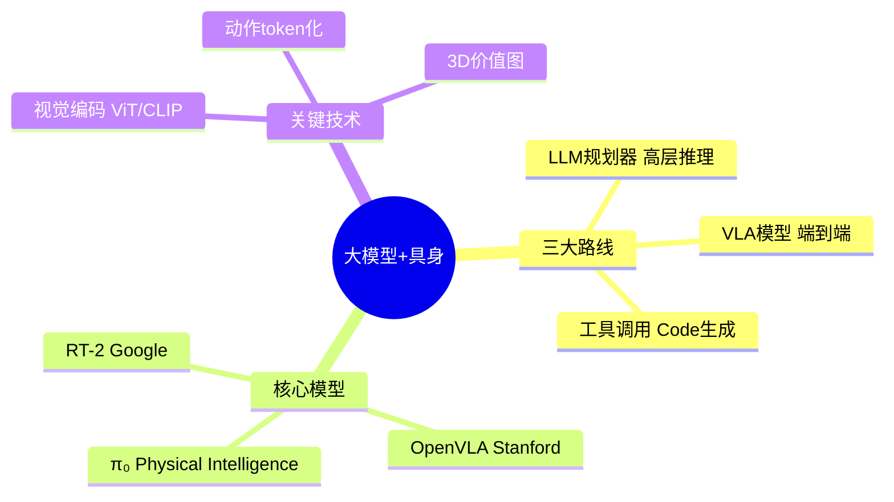

# Day 7 · 大模型+具身

> LLM规划器、VLA模型、工具调用

← [[Day 6 - 模仿学习]] **[[📚 具身智能10天入门|目录]]** → [[Day 8 - 仿真平台]]

#大模型 #VLA #LLM #具身智能

---

## 🗺️ 知识地图



---

## 🎯 核心问题

1. **LLM 如何理解物理世界？**（语言空间 → 动作空间的鸿沟）
2. **VLA 模型如何端到端训练？**（视觉-语言-动作联合优化）
3. **如何不用训练就让LLM控制机器人？**（VoxPoser 零样本范式）
4. **大模型延迟如何解决实时控制？**（推理延迟 vs 200Hz 控制周期）

---

## 🔧 核心方法

| 路线 | 代表工作 | 优势 | 劣势 |
|------|---------|------|---------|
| LLM规划器 | SayCan, Code as Policy | 可解释、可编辑 | 依赖底层控制器 |
| VLA端到端 | RT-2, OpenVLA | 端到端、泛化强 | 数据需求大、黑盒 |
| LLM工具调用 | VoxPoser | 零样本、无需训练 | 依赖代码生成质量 |
| 分层架构 | HiP, RoboCat | 长程任务、模块化 | 模块间误差累积 |

---

## 🔗 因果链

```
自然语言指令
  ↓ LLM 语义解析
任务分解：subtask_1, subtask_2, ...
  ↓ 每个subtask：
  ├─ 视觉感知（What/Where）
  ├─ 动作规划（How）
  └─ 执行反馈（Success?）
  ↓ 闭环迭代
任务完成 / 失败重规划
```

---

## ⚠️ 易混点

| 混淆对 | 区别 | 典型错误 |
|--------|------|---------|
| VLA vs 分层规划 | VLA端到端一次性输出动作；分层先规划后执行 | 在简单任务上过度设计VLA |
| OpenVLA vs RT-2 | OpenVLA开源7B；RT-2未开源且更大 | 误认为RT-2可公开使用 |
| VoxPoser vs 传统规划 | VoxPoser用LLM生成代码；传统用PDDL/任务树 | 混淆"LLM生成代码"与"LLM直接控制" |
| 离散动作token vs 连续控制 | 离散token适合VLA预训练；连续控制适合底层执行 | 在精细操作任务上只用离散token |

---

## 📦 压缩：重建架构

```
┌─────────────────────────────────────────┐
│           指令输入（自然语言）           │
├─────────────────────────────────────────┤
│  LLM / VLM 推理层                      │
│  ├─ 任务分解                            │
│  ├─ 子任务规划                         │
│  └─ 动作序列生成                      │
├─────────────────────────────────────────┤
│  VLA 模型层（可选端到端）              │
│  ├─ 视觉编码器（ViT/CLIP）           │
│  ├─ 语言编码器（LLM）                 │
│  └─ 动作解码器（Transformer/扩散）     │
├─────────────────────────────────────────┤
│  底层执行层                              │
│  ├─ 运动规划（IK/RRT）                │
│  ├─ 力控（OSC/Cartesian）            │
│  └─ 安全监控（碰撞检测/急停）          │
└─────────────────────────────────────────┘
```

---

## 💡 压缩：提炼本质

> **VLA的本质**：将「视觉感知 + 语言理解 + 动作生成」统一到一个模型，实现端到端机器人控制。

> **LLM规划的本质**：利用大模型的常识推理能力，将自然语言指令分解为可执行的机器人动作原语。

**三个关键跨越**：
1. **语义 → 空间**：语言描述的"红色杯子" → 图像坐标 → 3D抓取点
2. **任务 → 动作**："把杯子放桌上" → 抓取规划 → 放置规划
3. **仿真 → 真实**：VLA在仿真训练 → 零样本迁移到真实机器人

---

## 🔗 压缩：找联系

- **Day 7 ↔ Day 4**：VLA的视觉编码器 = ViT/ResNet（Day 4内容）
- **Day 7 ↔ Day 5**：VLA的动作解码器可用RL微调（PPO/SAC）
- **Day 7 ↔ Day 6**：VLA训练数据 = 大量演示数据（模仿学习）
- **Day 7 ↔ Day 9**：LLM规划的输出需要交给运动规划器执行（RRT/IK）

---

## 🚨 压缩：易错点

1. **LLM幻觉问题**：LLM可能生成不可执行的动作序列，必须加执行前验证
2. **VLA动作token化**：连续动作直接离散化会丢失精度，需用扩散或高斯策略
3. **仿真训练Sim2Real**：VLA在仿真训练后直接部署到真机，成功率骤降
4. **多模态对齐失败**：视觉-语言-动作三者特征空间未对齐，导致泛化失败
5. **实时性不足**：LLM推理延迟（秒级）vs 机器人控制周期（毫秒级）

---

## 📖 详细内容

### 路线A：LLM规划器

LLM接收自然语言指令，输出高层动作序列，底层由传统控制器执行。

```python
# LLM驱动的机器人任务规划（SayCan风格）
def llm_task_planner(instruction: str, scene_description: str) -> List[str]:
    prompt = f"""
You are a robot task planner.
Instruction: {instruction}
Current scene: {scene_description}
Available skills: [pick(obj), place(obj, loc), navigate(loc), open(obj), close(obj)]
Output a step-by-step plan as a JSON list.
"""
    plan_json = llm.generate(prompt)
    return json.loads(plan_json)

# 执行计划
plan = llm_task_planner("make coffee", "kitchen with coffee machine")
for step in plan:
    execute_skill(step)  # 调用底层控制器
```

---

### 路线B：VLA模型（RT-2 / OpenVLA）

视觉-语言-动作模型，端到端输出机器人控制指令。

```python
# OpenVLA 快速使用（HuggingFace）
from transformers import AutoModelForVision2Seq, AutoProcessor
from PIL import Image

processor = AutoProcessor.from_pretrained("openvla/openvla-7b")
model = AutoModelForVision2Seq.from_pretrained("openvla/openvla-7b")

image = Image.open("robot_view.jpg")
instruction = "pick up the red cup"

inputs = processor(text=instruction, images=image, return_tensors="pt")
action = model.generate(**inputs, max_new_tokens=100)
print(f"预测动作: {action}")
```

---

### 路线C：LLM工具调用（VoxPoser）

LLM生成Python代码描述3D价值图，无需训练即可控制机器人。

> [!info] VoxPoser核心思想
> ① 用VLM理解场景和指令 → ② LLM生成Python代码描述动作约束 → ③ 在3D感知空间中优化生成无碰撞轨迹 → ④ 轨迹下发到机器人执行。**无需RL训练，无需额外微调！**

```python
# VoxPoser 核心流程（伪代码）
def voxposer_control(instruction: str, rgb: np.ndarray, depth: np.ndarray):
    # Step 1: VLM理解场景
    scene_description = vlm.describe(rgb)
    # Step 2: LLM生成3D价值图代码
    code = llm.generate(f"""
Instruction: {instruction}
Scene: {scene_description}
Generate Python code that defines:
  - affordance_map: where the robot should go
  - constraint_map: where the robot should avoid
Output only Python code.
""")
    # Step 3: 执行代码生成3D价值图
    exec(code)
    # Step 4: 轨迹优化
    trajectory = optimize_trajectory(affordance_map, constraint_map)
    return trajectory
```

---

### 📄 必读论文

#### 📄 RT-2（Google DeepMind, 2023）
将VLM直接输出动作token，zero-shot泛化惊人。 #VLA鼻祖 #必读

#### 📄 OpenVLA（Stanford, 2024）
开源VLA模型，7B参数，支持97个机器人任务的zero-shot控制。 #开源SOTA #推荐

#### 📄 π₀（Physical Intelligence, 2024）
Diffusion Policy + VLM foundation模型，通用机器人控制。 #最新进展 #前沿

---

## ✅ 今日任务

- [ ] 理解三条路线的适用场景和优缺点
- [ ] 运行OpenVLA的demo（HuggingFace有现成示例）
- [ ] 精读RT-2论文，理解VLA的端到端训练方法
- [ ] 了解LLaMA-Ego（第一人称视觉-语言-动作）最新进展

---

## 相关笔记

← [[Day 6 - 模仿学习]] **[[📚 具身智能10天入门|目录]]** → [[Day 8 - 仿真平台]]
