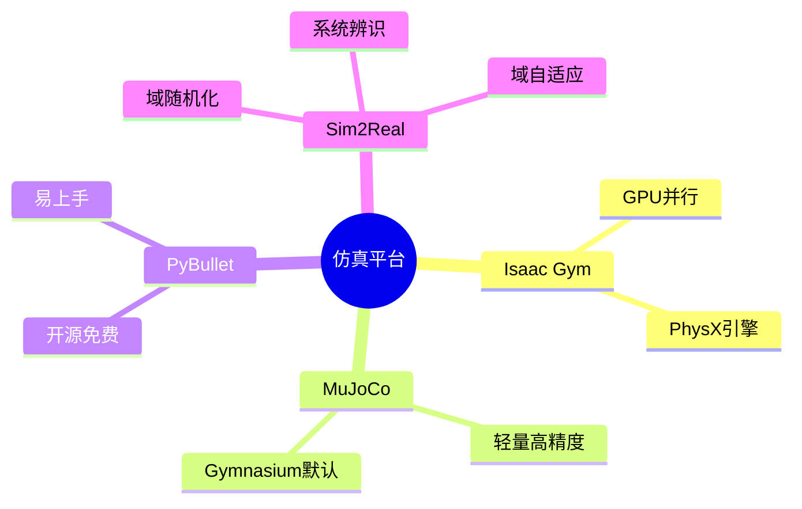

# Day 8 · 仿真平台

> Isaac Gym、MuJoCo、PyBullet与Sim2Real

← [[Day 7 - 大模型+具身]] **[[📚 具身智能10天入门|目录]]** → [[Day 9 - 运动与操作]]

#仿真 #MuJoCo #IsaacGym #Sim2Real

---

## 🗺️ 知识地图



---

## 🎯 核心问题

1. **为什么需要仿真？**（真实机器人数据采集成本高、风险大）
2. **不同仿真器的取舍？**（精度 vs 速度 vs 易用性）
3. **Sim2Real 鸿沟的本质是什么？**（物理参数差异、传感器噪声）
4. **如何提升 Sim2Real 成功率？**（域随机化 / 系统辨识 / 域适应）

---

## 🔧 核心方法

| 仿真器 | 特点 | 最适用场景 |
|---------|------|---------|
| **Isaac Gym** | GPU 并行数千环境，速度快 | 大规模 RL 训练 |
| **MuJoCo** | 数学精度高，DRL 论文标准 | 算法研发、benchmark |
| **PyBullet** | 开源、Python 原生、易调试 | 教学、快速原型 |
| **Gazebo** | ROS 深度集成，工业级 | 完整机器人系统仿真 |

**Sim2Real 三大解法**：

| 方法 | 核心思想 | 效果 |
|------|---------|------|
| 域随机化 Domain Randomization | 训练时随机化物理参数，策略学会适应各种参数 | ★★★ |
| 系统辨识 System ID | 精确测量真实机器人参数，仿真中精确建模 | ★★ |
| 域自适应 Domain Adaptation | GAN/CORAL 对齐仿真与真实特征分布 | ★★ |

---

## 🔗 因果链

```
仿真环境参数（摩擦/质量/阻尼）
  ↓ 域随机化：在参数分布上采样训练
策略 π_θ 在多样化动力学上训练
  ↓ 策略学会对参数变化鲁棒
部署到真实机器人
  ↓ 真实世界参数 ∈ 训练时的参数分布
任务成功率保持
```

---

## ⚠️ 易混点

| 混淆对 | 区别 | 典型错误 |
|--------|------|---------|
| Isaac Gym vs MuJoCo | Isaac Gym GPU 并行快；MuJoCo 精度高单线程 | 小规模实验用 Isaac Gym（过度复杂）|
| Sim2Real vs 域随机化 | Sim2Real 是目标；域随机化是手段之一 | 认为域随机化是唯一 Sim2Real 解法 |
| GPU 并行 vs 数据并行 | GPU 并行是环境步并；数据并行是 batch 并 | 混淆两个并行的层级 |
| 系统辨识 vs 域随机化 | 前者精确建模真实；后者覆盖更广分布 | 在参数难以测量的场景强行系统辨识 |

---

## 📦 压缩：重建架构

仿真-真实迁移完整流水线：

```
┌─────────────────────────────────────────┐
│   阶段1：仿真环境构建                     │
│   ├─ 机器人 URDF/MJCF 建模            │
│   ├─ 物理参数设定（摩擦/质量/阻尼）    │
│   └─ 渲染器（RGB / 深度 / 分割）     │
├─────────────────────────────────────────┤
│   阶段2：域随机化                     │
│   ├─ 物理参数随机范围设定              │
│   ├─ 视觉外观随机（光照/纹理）        │
│   └─ 每 episode 采样不同参数          │
├─────────────────────────────────────────┤
│   阶段3：大规模 RL 训练                │
│   ├─ Isaac Gym 千环境并行             │
│   └─ PPO/SAC 训练                  │
├─────────────────────────────────────────┤
│   阶段4：Sim2Real 部署                │
│   ├─ 零样本部署（直接迁移）           │
│   ├─ 少量真实数据微调                │
│   └─ 在线适应（RL 继续训练）         │
└─────────────────────────────────────────┘
```

---

## 💡 压缩：提炼本质

> **仿真的本质**：用低成本近似真实世界动力学，让策略在「接近真实」的分布上学习。

> **Sim2Real 的本质**：缩小「仿真参数分布」与「真实世界参数」之间的差距。

**三个核心结论**：
1. 域随机化比提高仿真精度更有效（覆盖分布 > 单点精确）
2. 视觉 Sim2Real 比动力学 Sim2Real 更容易（GAN 风格迁移管用）
3. 少量真实数据微调 = Sim2Real 的最后一块拼图

---

## 🔗 压缩：找联系

- **Day 8 ↔ Day 5**：仿真环境 = RL 训练场，PPO/SAC 依赖仿真采样
- **Day 8 ↔ Day 6**：仿真数据增强 = DexMimicGen 的核心技术
- **Day 8 ↔ Day 10**：Sim2Real 成功率 = 具身智能落地的核心瓶颈

---

## 🚨 压缩：易错点

1. **域随机化范围设太大**：策略学不到有效行为（太难）；太小：Sim2Real 失效
2. **忽略传感器噪声建模**：仿真中完美观测 → 真实传感器噪声导致失败
3. **仿真步长 dt 与真实不一致**：dt 不同 → 动力学行为不同 → 控制频率不匹配
4. **只在单一仿真环境中评估**：必须多仿真交叉验证泛化性

---

## 📖 详细内容

### 1. 仿真器对比

**Isaac Gym（NVIDIA）**
- GPU 并行：数千个环境同时仿真，速度极快
- PhysX 物理引擎，高保真
- 需要注册 NVIDIA 开发者账号下载
- **最推荐用于大规模 RL 训练**

**MuJoCo（DeepMind 开源）**
- 轻量级、速度快、数学精度高
- Gymnasium/Farama 的默认环境后端
- 几乎所有 DRL 论文都用它
- **必学！**

**PyBullet**
- 开源免费，Python 原生支持
- 易上手，适合快速原型开发
- 物理精度中等
- **教学和小型项目首选**

**Gazebo（ROS 官方）**
- 工业级仿真，与 ROS1/2 深度集成
- 支持复杂室外场景和多机器人
- 速度较慢，不适合大规模 RL

---

### 2. MuJoCo + Gymnasium 快速上手

```python
# MuJoCo + Gymnasium 机器人环境快速上手
import gymnasium as gym; import mujoco; import numpy as np

# 方式1: 使用 Gymnasium 内置环境（推荐起步）
env = gym.make("HalfCheetah-v5", render_mode="human")
obs, info = env.reset()
for step in range(1000):
    action = env.action_space.sample()
    obs, reward, terminated, truncated, info = env.step(action)
    if terminated or truncated: obs, info = env.reset()
env.close()

# 方式2: 直接用 MuJoCo 创建自定义机器人
xml_string = """
<mujoco model="arm">
  <worldbody>
    <body name="base" pos="0 0 0">
      <joint name="joint0" type="hinge" axis="0 0 1" pos="0 0 0"/>
      <geom type="capsule" size="0.05 0.2" pos="0 0.2 0" rgba="0.6 0.2 0.2 1"/>
    </body>
  </worldbody>
  <actuator><motor joint="joint0" ctrllimited="true" ctrlrange="-1 1"/></actuator>
</mujoco>
"""
model = mujoco.from_xml_string(xml_string)
data = mujoco.MjData(model)
renderer = mujoco.Renderer(model)
for _ in range(500):
    data.ctrl[0] = np.sin(_ * 0.05)
    mujoco.step(model, data)
    renderer.update_scene(data)
    img = renderer.render()
print(f"仿真步数: {data.time:.2f}s, 关节角度: {data.qpos}")
```

---

### 3. Sim2Real 核心挑战

> [!info] 核心要点
> 为什么 Sim2Real 很难？
> 仿真环境中的物理参数（摩擦力、质量、阻尼）只是对真实世界的近似。训练好的策略在仿真中表现完美，迁移到真机后可能完全失效。
>
> **三大解决方案**：
> ① **域随机化（Domain Randomization）**：在仿真中随机化物理参数，让策略适应各种情况
> ② **系统辨识（System Identification）**：准确测量真实机器人的物理参数，在仿真中精确建模
> ③ **域自适应（Domain Adaptation）**：使用 GAN/CORAL 等方法对齐仿真与真实的特征分布

```python
# 域随机化示例（PyBullet）
import pybullet as p

def randomize_physics(env):
    # 随机化摩擦力
    friction = np.random.uniform(0.5, 1.5)
    p.changeDynamics(env.robot_id, -1, lateralFriction=friction)
    # 随机化质量
    mass = np.random.uniform(0.8, 1.2) * base_mass
    p.changeDynamics(env.robot_id, -1, mass=mass)
    # 随机化电机阻尼
    damping = np.random.uniform(0.01, 0.1)
    for joint in range(p.getNumJoints(env.robot_id)):
        p.changeDynamics(env.robot_id, joint, jointDamping=damping)
```

---

## ✅ 今日任务

- [ ] 安装 MuJoCo 和 Gymnasium，运行一个内置机器人环境（Ant-v5）
- [ ] 理解 Isaac Gym 的 GPU 并行仿真机制
- [ ] 实现域随机化：在仿真中随机化摩擦力和质量，训练鲁棒策略
- [ ] 阅读论文：Domain Randomization for Transferring Deep RL Policies to the Real World

---

## 相关笔记

← [[Day 7 - 大模型+具身]] **[[📚 具身智能10天入门|目录]]** → [[Day 9 - 运动与操作]]
