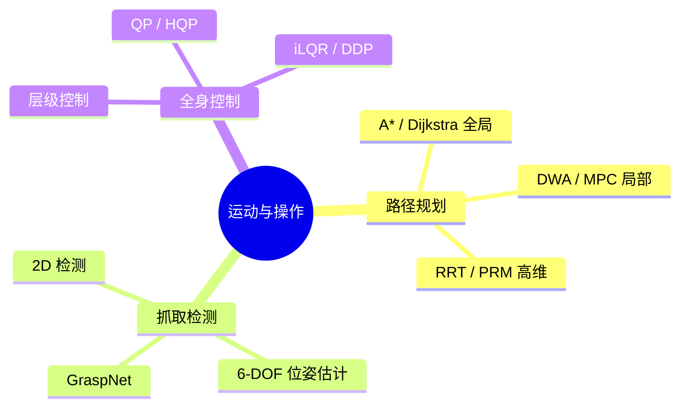

# Day 9 · 运动与操作

> 路径规划、抓取检测、全身控制

← [[Day 8 - 仿真平台]] **[[📚 具身智能10天入门|目录]]** → [[Day 10 - 前沿与实战]]

#运动规划 #抓取 #RRT #控制#

---

## 🗺️ 知识地图



---

## 🎯 核心问题

1. **如何在高维空间中高效规划？**（RRT/RRT* 采样规划）
2. **如何估计6-DOF抓取位姿？**（旋转矩阵 + 平移 + 开口宽度）
3. **如何协调多自由度全身运动？**（QP 优化 / 层级控制）
4. **规划与控制在真实机器人上如何保证安全？**（碰撞检测 / 力矩限制）

---

## 🔧 核心方法

| 方法 | 核心思想 | 适用场景 |
|------|---------|---------|
| A* / Dijkstra | 图搜索，保证最优 | 2D 栅格地图全局规划 |
| DWA / MPC | 局部窗口优化，考虑动力学 | 动态避障、实时导航 |
| RRT / RRT* | 随机采样 + 渐进最优 | 高维机械臂规划 |
| 6-DOF 抓取 | 估计 (R, t, width) | 灵巧操作、物体抓取 |
| QP 控制 | $\min \frac{1}{2}x^T H x + g^T x$ | 全身协调、约束多 |
| iLQR / DDP | 微分动态规划，利用二阶导数 | 高动态运动（行走/跳跃）|

---

## 🔗 因果链

```
任务指令（"抓取红色杯子"）
  ↓ 场景感知（YOLO + 深度）
目标物体 3D 位置 (X,Y,Z)
  ↓ 6-DOF 抓取检测
抓取位姿 R ∈ SO(3), t ∈ ℝ³, width
  ↓ 运动规划（RRT*）
无碰撞关节轨迹 q(t)
  ↓ 全身控制（QP/iLQR）
关节力矩 τ = f(q, q̇, q̈)
  ↓ 执行器
成功抓取 ✓
```

---

## ⚠️ 易混点

| 混淆对 | 区别 | 典型错误 |
|--------|------|---------|
| RRT vs RRT* | RRT 不保证最优；RRT* 渐进最优但慢 | 在实时系统中用 RRT* |
| 6-DOF 抓取 vs 平行夹爪 | 前者需估计完整位姿；后者只需 (x,y,z,yaw) | 用平行夹爪方法做多指手抓取 |
| QP vs HQP | QP 一次求解；HQP 分层优先级 | 在严格优先级约束上用普通 QP |
| iLQR vs DDP | iLQR 忽略二阶导数；DDP 用完整 Hessian | 在强非线性系统上用 iLQR（收敛慢）|

---

## 📦 压缩：重建架构

运动与操作系统架构：

```
┌─────────────────────────────────────┐
│   任务层（"抓取杯子"）                │
├─────────────────────────────────────┤
│   感知层                                    │
│   目标检测 → 3D 定位 → 抓取点估计      │
├─────────────────────────────────────┤
│   规划层                                    │
│   ├─ 全局：RRT* / A*                │
│   ├─ 局部：DWA / MPC                │
│   └─ 轨迹优化：iLQR / CHOMP        │
├─────────────────────────────────────┤
│   控制层                                    │
│   ├─ 位置控制：PD / OSC             │
│   ├─ 力矩控制：QP / HQP             │
│   └─ 全身协调：WBC                 │
├─────────────────────────────────────┤
│   执行层                                    │
│   关节驱动器 → 力矩/位置指令           │
└─────────────────────────────────────┘
```

---

## 💡 压缩：提炼本质

> **路径规划的本质**：在约束空间（障碍物、关节限位）中搜索可行轨迹，并优化某种代价函数（最短/最平滑/最安全）。

> **抓取的本质**：找到物体表面上「稳定、可达、无碰撞」的六维位姿 (R, t) 和开口宽度。

> **全身控制的本质**：在冗余自由度中，在满足动力学约束和接触约束的前提下，优化任务目标。

**记忆口诀**：
- 全局规划 = 先找路，再优化
- 局部规划 = 边走边看，实时避障
- 抓取 = 看得清（感知）+ 够得着（IK）+ 握得稳（力学）
- 全身控制 = 优先级 + 约束优化

---

## 🔗 压缩：找联系

- **Day 9 ↔ Day 2**：IK 求解器是运动规划的基础子模块
- **Day 9 ↔ Day 3**：6-DOF 抓取依赖深度感知和 3D 重建
- **Day 9 ↔ Day 5**：强化学习可替代传统规划（端到端策略）
- **Day 9 ↔ Day 6**：模仿学习可用于学习抓取策略（ACT / DexMimicGen）
- **Day 9 ↔ Day 8**：仿真中大量采样用于训练规划器和抓取检测器

---

## 🚨 压缩：易错点

1. **RRT 在高维空间采样效率低**：需要人工指导（Inverse Reachability）或学习采样分布
2. **6-DOF 抓取评估忽略物理稳定性**：只看几何匹配，不做力学分析（摩擦力金字塔）
3. **QP 优化数值不稳定**：Hessian 不正定 → 加正则化或用 HQP
4. **Sim2Real 在规划上的差距**：仿真中无噪声 → 真实传感器噪声导致规划失败
5. **忽略机器人奇异点**：IK 求解时未检测接近奇异 → 关节速度爆炸

---

## 📖 详细内容

### 1.1 A* 算法（全局路径规划）

```python
# A* 算法实现（全局路径规划）
import heapq

def astar(grid, start, goal, heuristic="manhattan"):
    def h(p):
        return abs(p[0]-goal[0]) + abs(p[1]-goal[1]) if heuristic=="manhattan" \
               else ((p[0]-goal[0])**2 + (p[1]-goal[1])**2)**0.5
    rows, cols = len(grid), len(grid[0])
    pq = [(h(start), 0, start, [start])]
    visited = set()
    dirs = [(0,1),(0,-1),(1,0),(-1,0)]
    while pq:
        f, g, cur, path = heapq.heappop(pq)
        if cur == goal: return path
        if cur in visited: continue
        visited.add(cur)
        for dx, dy in dirs:
            nxt = (cur[0]+dx, cur[1]+dy)
            if 0<=nxt[0]<rows and 0<=nxt[1]<cols and grid[nxt[0]][nxt[1]]!=1 and nxt not in visited:
                heapq.heappush(pq, (g+1+h(nxt), g+1, nxt, path+[nxt]))
    return None
```

---

### 1.2 RRT*（高维机械臂运动规划）

```python
# RRT*（高维机械臂运动规划）
import numpy as np; import random

class RRTStar:
    def __init__(self, bounds, obstacles, max_iters=5000):
        self.bounds = bounds; self.obstacles = obstacles
        self.max_iters = max_iters; self.nodes = []; self.parent = {}

    def sample(self):
        return [random.uniform(*b) for b in self.bounds]

    def nearest(self, p):
        return min(self.nodes, key=lambda x: np.linalg.norm(np.array(x)-np.array(p)))

    def in_collision(self, point):
        return any(np.linalg.norm(np.array(point)-np.array(obs)) < obs_r
                   for obs, obs_r in self.obstacles)
```

---

### 2. 6-DOF 抓取检测

不同于 2D 抓取检测，6-DOF 抓取同时估计抓取点的 3D 位置、旋转角度（Roll/Pitch/Yaw）和开口宽度。

```python
# GraspNet: 6-DOF 抓取检测
# pip install graspnetAPI  # https://github.com/qq456ctb/graspness
from graspnetAPI.graspnet import GraspNet; import numpy as np

def grasp_detection(rgb_image, depth_image, camera_intrinsics):
    net = GraspNet().to("cuda"); net.load_state_dict(torch.load("graspnet_pretrained.pth")); net.eval()
    with torch.no_grad():
        grasps = net(rgb_image, depth_image, camera_intrinsics)
    best_grasp = grasps[0]
    pos_3d = best_grasp["position"]; rot_6d = best_grasp["rotation"]
    width = best_grasp["width"]; score = best_grasp["score"]
    return {"position": pos_3d, "rotation": rot_6d, "width": width, "score": score}

# 简单替代方案: 基于几何的抓取点检测
def simple_grasp(rgb, depth, K, target_object_mask):
    ys, xs = np.where(target_object_mask > 0)
    center_u, center_v = np.mean(xs), np.mean(ys)
    depth_val = depth[int(center_v), int(center_u)] / 1000.0
    cx = (center_u - K[0,2]) * depth_val / K[0,0]
    cy = (center_v - K[1,2]) * depth_val / K[1,1]
    grasp_pose = np.array([cx, cy, depth_val, 0, 0, 0])
    return grasp_pose
```

---

### 3. 全身控制（iLQR / DDP）

人形机器人需要同时协调双臂、躯干、腿部等多个身体部位。

```python
# 微分动态规划（DDP）用于全身轨迹优化
import numpy as np

class iLQR:
    def __init__(self, dynamics, cost_fn, n_steps=100):
        self.dynamics = dynamics; self.cost = cost_fn; self.n_steps = n_steps

    def solve(self, x0, u_init, max_iters=50):
        x = [x0]; u = [u_init]
        for k in range(max_iters):
            # 前向传播
            x_new = [x0]
            for t in range(self.n_steps):
                x_next = self.dynamics(x_new[-1], u[t])
                x_new.append(x_next)
            # 后向传播（省略完整实现）
            break
        return x, u

print("iLQR 全身轨迹优化框架就绪！")
```

**全身控制三大方法对比**：

| 方法 | 核心思想 | 优势 | 劣势 |
|------|---------|------|---------|
| 层级控制 | 躯干→手臂→关节，自顶向下 | 计算效率高 | 局部最优 |
| QP / HQP | 二次规划，处理约束 | 严格满足约束 | 数值稳定性 |
| End-to-End RL | 直接学策略 | 自适应强 | 样本效率低 |

---

## ✅ 今日任务

- [ ] 实现 A* 算法并在网格地图上测试
- [ ] 理解 RRT/RRT* 在高维机械臂规划中的应用
- [ ] 理解 6-DOF 抓取检测的核心挑战
- [ ] 阅读论文：GraspNet (CVPR 2019) 或 DexPilot

---

## 相关笔记

← [[Day 8 - 仿真平台]] **[[📚 具身智能10天入门|目录]]** → [[Day 10 - 前沿与实战]]
