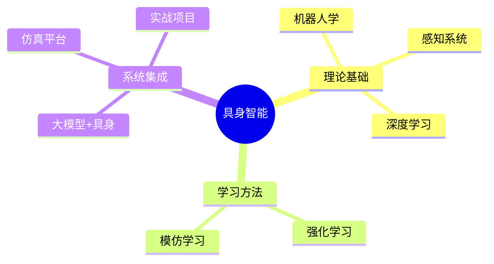

# 📚 具身智能10天入门

> 从核心概念到前沿进展，从理论到实战，系统掌握具身智能全栈知识体系。

## 学习时间线

### [[Day 1 - 具身智能导论]]
> 导论与基础
#具身智能 #导论 #SLAM

### [[Day 2 - 机器人学基础]]
> 正逆运动学、动力学与ROS2
#机器人学 #运动学 #ROS2

### [[Day 3 - 感知系统]]
> 视觉、深度、SLAM与传感器融合
#感知 #计算机视觉 #SLAM

### [[Day 4 - 深度学习基础]]
> CNN、Transformer与多模态模型
#深度学习 #CNN #Transformer

### [[Day 5 - 深度强化学习]]
> MDP、PPO、SAC与机器人控制
#强化学习 #PPO #SAC

### [[Day 6 - 模仿学习]]
> 行为克隆、DAgger、GAIL、扩散策略
#模仿学习 #行为克隆 #GAIL

### [[Day 7 - 大模型+具身]]
> LLM规划器、VLA模型、工具调用
#大模型 #VLA #LLM

### [[Day 8 - 仿真平台]]
> Isaac Gym、MuJoCo、PyBullet与Sim2Real
#仿真 #MuJoCo #IsaacGym

### [[Day 9 - 运动与操作]]
> 路径规划、抓取检测、全身控制
#运动规划 #抓取 #RRT

### [[Day 10 - 前沿与实战]]
> 2024-2025前沿 + 综合项目
#前沿 #实战 #Figure

---
## 知识地图

## 快速导航

- [[Day 1 - 具身智能导论|开始学习 →]]
- 只看代码 → 搜索 `#实践`
- 只看论文 → 搜索 `#论文`

**标签索引:** #具身智能 #深度学习 #强化学习 #机器人学 #大模型
